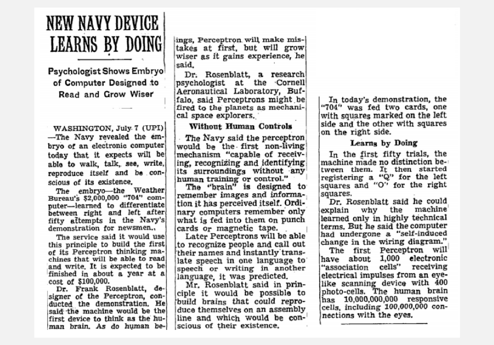

## Machine Learning In Legal Tech - What's new?

### Daniel Roythorne, ThoughtRiver Ltd.

---
@snap[north]
## Outline
@snapend

@snap[midpoint text-02]
@ol
- What's old? - Where do the ideas and technologies behind today's legal tech AI originate?
- What's new? - Why the recent hype around AI in legal tech could be well founded. 
- How does it work in theory? - An open-top-bus tour of modern machine learning (ML) techniques by example.
- What about in practice? - Engineering and integration.
- What are the limits?
@olend
@snapend
---

@snap[north span-60]
## What's old? - Neural Networks
@snapend

@snap[midpoint span-60]

@snapend

@snap[south doclink span-90]
@size[small]((1958&#41; 'New Navy Device Learns By Doing', New York Times, 8 July, p.25)
@snapend

---

@snap[north span-60]
## What's old? - Neural Networks in Law
@snapend

@snap[midpoint span-60]

@snapend

@snap[south doclink span-90]
@size[small](Belew, R. K. (1987&#41; 'A Connectionist Approach to Conceptual Information Retrieval', ICAIL)
@snapend

---

@snap[north span-60]
## Promises, promises!
@snapend

@snap[midpoint span-60]

@snapend

@snap[south doclink span-90]
@size[small](Gartner 2018, '5 Trends Emerge in the Gartner Hype Cycle for Emerging Technologies, 2018', viewed 5 August 2019, <https://www.gartner.com/smarterwithgartner/5-trends-emerge-in-gartner-hype-cycle-for-emerging-technologies-2018>)
@snapend

---

## Why now?

