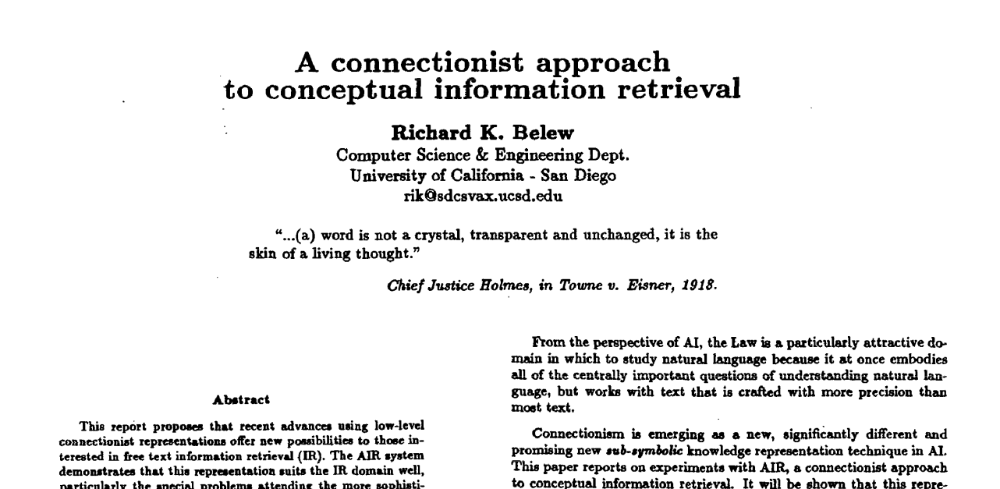
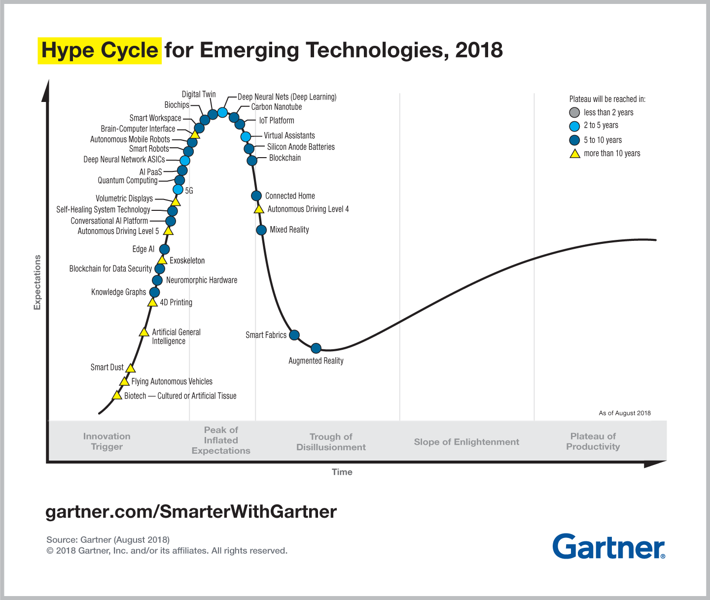

## Machine Learning In Legal Tech - What's new?

### Daniel Roythorne, ThoughtRiver Ltd.

---

## Outline

- What's old? - Where do the ideas and technologies behind today's legal tech AI originate?
- What's new? - Why the recent hype around AI in legal tech could be well founded. 
- How does it work in theory? - An open-top-bus tour of modern machine learning (ML) techniques by example.
- What about in practice? - Engineering and integration.
- What are the limits?

---

## What's old?

@snap[midpoint span-60]

@snapend

@snap[south doclink span-90]
A Connectionist Approach to Conceptual Information Retrieval, R. K. Belew, ICAIL (1987)
@snapend

---

---

## Why now?

