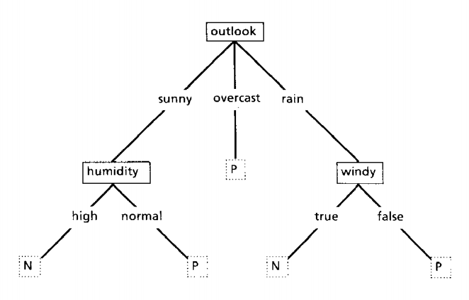

## Machine Learning In Legal Tech - What's new?

### Daniel Roythorne, ThoughtRiver Ltd.

---

## Outline

@ul[]
- What's old? - What are the origins of today's legal tech AI?
- What's new? - Is the hype around AI in legal tech well founded?
- How does it work in theory? - Machine learning (ML) techniques for contract review.
- What about in practice? - Engineering and integration.
@ulend

---

@snap[north span-60]
### What's old? - Neural Networks
@snapend

@snap[west span-40]
Foundational idea, the nerual network, is from 1958.
@snapend

@snap[east span-60]

@snapend

@snap[south-east doclink span-60]
@size[small](Rosenblatt, F.(1958&#41;. 'The perceptron: A probabilistic model for information storage and organization in the brain', Psychological Review, 65(6&#41;, 386-408.)
@snapend

Note: 
- perceptron.png image available

---

@snap[north span-60]
### What's old? - Neural Networks
@snapend

@snap[west span-40]
Grand promises being made in the same year.
@snapend

@snap[east span-60]

@snapend

@snap[south-east doclink span-60]
@size[small]((1958&#41; 'New Navy Device Learns By Doing', New York Times, 8 July, p.25)
@snapend

---

@snap[north span-60]
### What's old? - Expert systems
@snapend

@snap[west text-03 span-60]
- 'capable not only of emulating the expert in the quality of decisions, but also in the ability to give reasons and justification'
- 'bottleneck problem of artifical intelligence' (Feigenbaum, 1977)
@snapend

@snap[east span-60]

@snapend

@snap[south-east doclink span-60]
@size[small](Michie D. (1985&#41. Current developments in artificial intelligence and expert systems. Zygon, 20(4&#41, pp.375-389.)
@snapend

Notes:
- Expert systems (e.g. GASOIL), complexity of getting domain input, completeness, contradictions/noise (apoplectic engineer)
- Teaching is done by presenting a cleverly graded and sequenced series of tutorial examples. (Know-how -> Say-how -> Show-how)
- 'Expert articulacy is not independent of complexity. ' -> requirements for inductive inference
- process is iterative
- real world is the oracle ('historical' rather than 'tutorial' training sets - statistical ML)
- still see spirit of expert systems in buiness rules-engines (e.g. Java Drools)
- translation of points-of-meaning extracted from text (using ML) postprocessed with 'expert-system' rules to derive contractual risk

---

@snap[north span-60]
### What's old? - Classification algorithms
@snapend

@snap[west text-03 span-60]
Quinlan's 'Induction of Decision Trees' paper contains many of the concepts from modern inductive ML:
- the *training set*
- generalisation through regularisation
- noisy training sets
- missing data

@snapend

@snap[east span-60]

@snapend

@snap[south-east doclink span-60]
@size[small](Quinlan, J.R. (1986&#41. Induction of Decision Trees. J.R. Mach Learn, 1, pp.81-106)
@snapend

Notes:
- Distinction between tutorial sets and 'historical record' approaches (Donald Michie) (and ref to active learning)

---

### More old ideas

- Back propogation (many earlier references, but Yann LeCun in 1987)
- Automatic differentiation (by 1976, see Griewank, Andreas (2012))
- Long short-term memory (LSTM) (Hochreiter S. and Schmidhuber J. (1997))
- Transfer learning reviews back in 1998 (Thrun S. and Pratt L. (1998))

Notes:

- Le Cunn Y., 1987. "A theoretical framework for Back-Propagation", in Touretzky, D. and Hinton, G. and Sejnowski, T. (Eds), Proceedings of the 1988 Connectionist Models Summer School, 21-28, Morgan Kaufmann, CMU, Pittsburgh, Pa, 1988
- Griewank, Andreas (2012). Who Invented the Reverse Mode of Differentiation?. Optimization Stories, Documenta Matematica, Extra Volume ISMP (2012), 389-400.)
- Sepp Hochreiter; Jürgen Schmidhuber (1997). "Long short-term memory". Neural Computation. 9 (8): 1735–1780.)
- (Thrun S. and Pratt L. (1998). "Learning to Learn". Kluwer Academic Publishers).

---

@snap[north span-60]
### What's old? - Neural Networks in Law
@snapend

@snap[west span-60]
- Belew used neural nets for document retrieval at the first International Conference on Artificial Intelligence and Law, 1987.
- document knowledge representation encoded in the weights of the network
@snapend

@snap[east span-60]

@snapend

@snap[south-east doclink span-60]
@size[small](Belew, R. K. (1987&#41; 'A Connectionist Approach to Conceptual Information Retrieval', ICAIL)
@snapend

---

@snap[north span-60]
## 'I've heard it all before!'
@snapend

@snap[east span-60]

@snapend

@snap[south-east doclink span-60]
@size[small](Gartner 2018, '5 Trends Emerge in the Gartner Hype Cycle for Emerging Technologies, 2018', viewed 5 August 2019, <https://www.gartner.com/smarterwithgartner/5-trends-emerge-in-gartner-hype-cycle-for-emerging-technologies-2018>)
@snapend

---

## 'I've heard it all before!'

@ul[text-05]
- The *Gartner Hype Cycle for Emerging Technologies 2018* featured 0 technologies reaching maturity
- ... and expectations are clustered around technologies that are > 5 years from usefulness 
@ulend

---

## What's new

@ul[]
- Moore's law no longer relevant - hardware specialised to machine learning workloads (GPU, TPU)  
- Packaging of research into well engineered software libraries and scientist-friendly langauges with open global communities (Spacy, Tensorflow, PyTorch, NumFocus)
- Transfer learning for NLP
- Cloud computing
@ulend

---

### Dedicated ML hardware
@snap[west span-60]
@ul[]
- Dedicated ML training and serving hardware on-demand (TPU, GraphCore)
- Billed by the minute by public IAAS providers
- *but* still expensive to train state-of-the-art models
@ulend
@snap[east span-60]

@snapend

---

## Machine learning for lawyers

Standard NLP courses address common themes (demonstrations at https://demo.allennlp.org):

@ul[text-04]
- tokenisation and segmentation
- part-of-speech classifiers, parse-trees, dependency parsing
- regular expressions
- named entity recognition
- semantic role labelling (frames)
- document classifiers and topic models
- language models
- embeddings (Word2Vec, Glove, FastText, Doc2Vec, DSSM)
- sequence-to-sequence tasks with recurrent networks 
@ulend

+++ 

## Tokenisation and segmentation

- how to decompose a sequence of characters into chunks
- and where to best splice those chunks into segments
- thankfully, English is straightforward in this respect (whitespace is 90% of the task)

Notes:
- neural end-to-end methods can work at the character level
- the relevant chunks are application dependent
- assumes a linear representation (legal documents better regarded as graphs)

+++

## Linguistic preprocessing

- traditional 'stacked' NLP has separate models for linguistic primatives
- part-of-speech classifiers tag tokens with their function (verbs, nouns, determiners)
- parse-trees (consituency parsing), dependency parsing 

Notes:
- these models still used as important features

+++

## Constituency parsing

+++

## Dependency parsing

+++

## Language models

@ul[]
- predict the missing word
- the internals encode important language features...
- which can be extracted and used on other tasks
- 
@ulend

+++

## Regular expressions

@ul[]
- origins in finite state automata
- 'hard' pattern recognition
- extremely effective in bounded contexts
- but nightmareish to maintain
@ulend

+++

## Named entity recognition (NER)

@ul[text-04]
- subsequences of tokens represent meaningful 'things'
- attach tags to contiguous tokens
- e.g. ORG (organisation), PROXY (reference terms), GPE (Countries, Cities, States)
- [spaCy models](https://spacy.io/models#architecture) and documentation are great sources
@ulend

@snap[south]

@snapend

Notes:
- https://explosion.ai/blog/parsing-english-in-python

+++

## Topic modelling

@ul
- unsupervised method
- infer from linear, generative models (e.g. Latent Dirichlet Allocation)
- remains useful for contract classification
@ulend

+++

## Embeddings

- e.g. word2vec (Mikolov, 2013)
- the representations learned by a language model are useful
- allow us to turn a token into a vector with useful properties

+++

## Sequence-to-sequence tasks

- machine translation ((Google Translate)[https://translate.google.com/])
- text summarisation ((frase.io review)[https://blog.frase.io/20-applications-of-automatic-summarization-in-the-enterprise/])
- diary management ((Amy)[https://x.ai/how-it-works/])

---

## Newer ideas

@ul[]
- transfer learning in NLP
- neural attention
- neural Turing machines
- weak supervision
@ulend

+++

## Transfer learning

- ULMFit, BERT and ELMO
- 'NLP's ImageNet moment'

+++

## Neural attention

- 'Attention is all you need'
- allow recurrent models to encompass larger contexts

+++

## Neural Turing machines

- neural networks together with 'addressable' memory (e.g. (DNC)[https://www.nature.com/articles/nature20101])
- haven't scaled to industrial problems

+++

## Weak supervision

- methods to use 'soft' labels to bootstrap our training data
- similarities with data fusion techniques from signal processing

---

## Examples from contract pre-screening

Consider the following quesitons that might be asked about a contract?

@ul[]
- Who are the parties and how are they referred to?
- Is the contract under the jurisdiction of a European Union country?
- Does an NDA prescribe a permitted use for confidential information?
- Does a purchase agreement specify a delivery date in the past?
- Does anything look out of place?
- When do provisions of an agreement terminate?
@ulend

But first, the glamourous bits ...

---

## Preprocessing

Garbage in, garbage out is still a truism.

@ul[]
- Microsoft Word is ubiquitous
- Injesting silos of images, .pdfs and deprecated file formats
- .docx parsing and source document representations (rich content retention)
- document type classification
- language detection
- normalisation (html tags, url encoding, hyperlinks, character decoding/encoding errors, cannonicalisation)
@ulend

---

## Party detection

@ul[]
- What legal entities are parties to the agreement?
- How to pick out references to those parties?
- What about references to groups, and reciprocal terms (e.g. 'the parties')
@ulend

Notes:

- Party detection as extraction of constitutive statement. (re: Legal Rule ML (http://docs.oasis-open.org/legalruleml/legalruleml-core-spec/v1.0/legalruleml-core-spec-v1.0.html))

+++

@snap[midpoint text-04]
This [type of agreement] (the “Agreement”) is made on …………. (“Effective Date”). 
  
BETWEEN: 
  
XAVIER INC whose operational office is at Greenville Park, Los Angeles, CA, 923040, USA (“XAVIER”); 
  
and 
  
YOLO LTD with its registered office at Stream Business Park, Santa Monica, CA, 90404, USA (“YOLO”). 
  
Separately a “party” and together the “parties”.
@snapend
---

## Jurisdiction

@snap[midpoint text-04]
6.1 This Agreement shall be governed for all purposes by the laws of Sudan and the parties irrevocably submit to the exclusive jurisdiction of the courts of North Korea.
@snapend

---

## Behavioural prescriptions and normative conditions

- statements of rights, prohibitions, obligations
- and the states of the world where they apply
- e.g. confidentiality clauses in NDAs

Notes:
- confidentiality-use-for-purpose - Does the agreement specify that there is an obligation on the parties to only use confidential information for the purpose of the agreement?

+++

@snap[midpoint text-06]
The use of the Confidential Information by the Recipient hereunder shall be limited solely to and for the purposes of Project Microsoft (the “Permitted Use”).
@snapend

+++

## Prescriptive statements with 'polarity'

- We must determine toward what party certain deontic notions apply.

---

## Engineering challenges

@ul[]
- data-driven systems are *far* more complex than regular software
- Simple software: data-B -> ALGORITHM -> data-A
- ML model: (data-C -> META-ALGORITHM -> ALGORITHM-A) + (Simple software)
- ML product: (data-A -> META-META-ALGORITHM -> META-ALGORITHM-A) + (ML model)
@ulend

+++

## ML deployment issues

@ul[]
- [Machine Learning: The High Interest Credit Card of Technical Debt](https://ai.google/research/pubs/pub43146)
- [Software Engineering for Machine Learning: A Case Study](https://www.microsoft.com/en-us/research/publication/software-engineering-for-machine-learning-a-case-study/)
- [What's your ML test score? A rubric for ML production systems](https://ai.google/research/pubs/pub45742)
@ulend

## Challenges

- Labelled data bottleneck
- Legal language is not natural language
- Complex domain ontology
- Extensive explicit and implicit context
- Ethics and regulation
- System complexity is high where behaviour is non-stationary
- Business process integration and engendering 'data science empathy'

+++

## Training data curation

@ul[]
- expert annotation is expensive
- managing data campaigns is nuanced (annotator quality, tooling, bias, training corpus selection)
- Mechanical Turk is not an option
- minimise volume of training data required
@ulend

+++

## Methods to minimise training volumes

Plenty of options, but no shinkwrapped methods. e.g.

@ul[]
- transfer learning
- active learning
- semi-supervised learning
- weak supervision
@ulend
 
+++

## Legal language is not natural language
- much lower entropy -> smaller models
- transferrability of results from academic research is not a given

+++ 

## Complex domain ontology
- harness the structure of legal concepts
- constrain models to give logically consistent answers (e.g. hierarchical classifiers)

+++

## Extensive explicit and implicit context 
- coalesce relevant information from distant parts of documents
- integration of external knowledge bases (e.g. company registers, OpenCorporates)

+++

## Ethics and regulation
- bias, fairnes
- explainability
- privacy preservation

---
